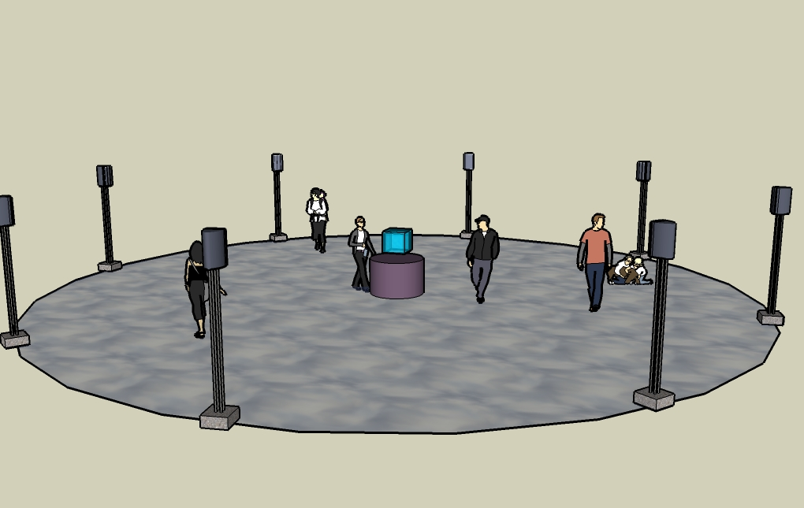
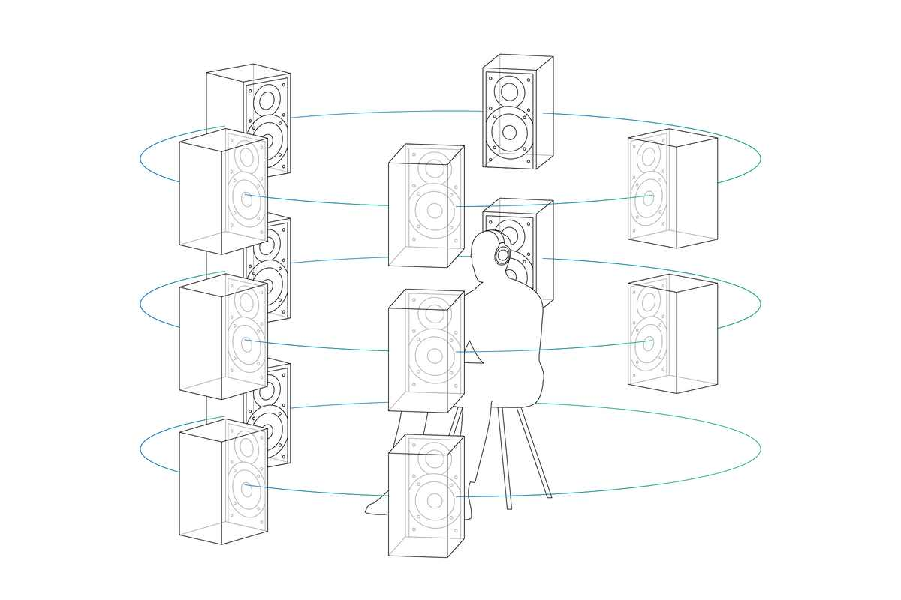
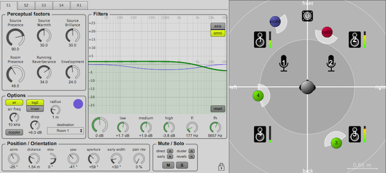

# La spatialisation sonore 3D

## Qu'est-ce que la spatialisation sonore ?
La spatialisation sonore est une action qui crée l'illusion de la localisation d'un son.

## Comment ça fonctionne ?
Les sons distants étant moins puissant auront des niveaux sonores plus bas pour décrire la distance avec le son. Pour donner une illusion auditoire d'un angle de 360 degrés, la méthode la plus courante serait de placer quatre enceintes dans une petite pièce telle que le petit studio.

# Concept pour le projet
Pour notre projet nous allons utiliser le petit studio pour mettre notre installation interactive. Cette dernière va utiliser des capteurs pour détecter des images et les projecteurs pour afficher notre projet sur les trois murs du studio. Pour rendre le tout plus immersif, la sonorisation de notre projet serait plus intéressante en spatialisation 3D ce qui viendrait complémenter les projecteurs qui afficheraient aussi en vue presque 360 dans le petit studio. Dans le projet, l'utilisation de spat sera en lien avec la table qui scan les statues. La table va produire un son 360 degrées dans la pièce lorsqu'un objet va être scanner et lorsqu'une action va se produire. La table sera donc le centre des sons pour le projet. Des hauts parleurs seront cacher dans la table de façon à pouvoir projeter le son dans toutes les directions.

# Spat Ircam
Spat est un plugin fait pour la spatialisation du son en temps réel et est utiliser pour la création de musique, postproduction et des performances en direct.

# Pourquoi avoir choisi Spat ?
Spat est un plugin du logiciel max qui est un logiciel que l'ont va utiliser pour notre projet donc tout avoir au même endroit permet d'éviter des tonnes de fichiers et de logiciels different. Nous allons utiliser spat avec des haut-parleurs, car lorque l'utilisateur va se déplacer le son doit pouvoir s'éloigner à contraire des écouteurs qui eux garde le même niveau sonore peut importe notre position dans la pièce.

# Que permet Spat ?
Spat permet de faire de la réverbération artificielle(Réverbération algorithmique évolutive), du contrôle perceptuel de la qualité acoustique de la pièce(Brillance,proximité d'une source sonore), de la procession de signal à bas niveau(Égalisation). Spat possède une interface graphique qui permet de controller et voir la scène de son spatialiser.

# Dans quelle domaine est-ce que Spat est applicable
Spat est applicable dans des composition musicales, films, réalité virtuelle, sonorisation et même durant des installations sonore en temps réel.

# Démo Spat
[Démo](https://www.youtube.com/watch?v=P23ipG_EfBI)

# Projets
- [Projets](https://forum.ircam.fr/topics/detail/45-Spat5/)
- [Exemple de l'utilisation du son](https://www.youtube.com/watch?v=3txhT2ncNOU)
- [Expérience rechercher](https://www.youtube.com/watch?v=3eLmfIpu8aM)
### Source
- https://fr.wikipedia.org/wiki/Spatialisation_sonore
- https://www.sony.ca/en/electronics/360-reality-audio
- https://www.youtube.com/watch?v=P23ipG_EfBI
- https://forum.ircam.fr/projects/detail/spat/#project-related-anchor
- https://forum.ircam.fr/topics/detail/45-Spat5/
