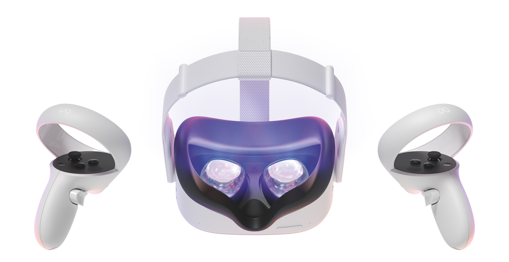
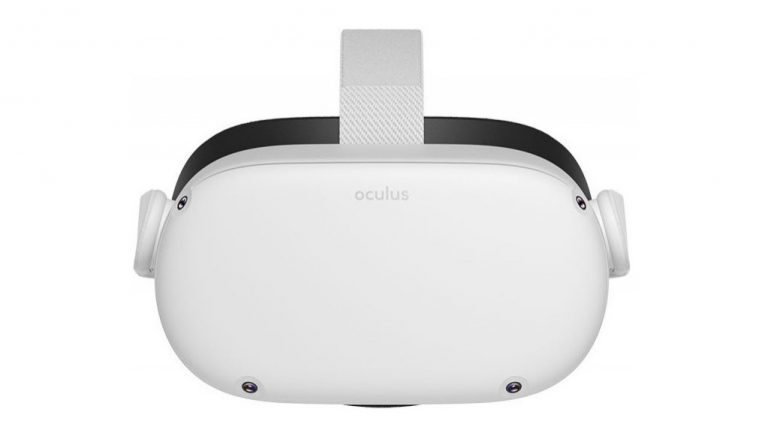
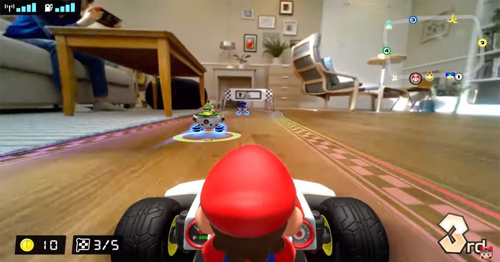
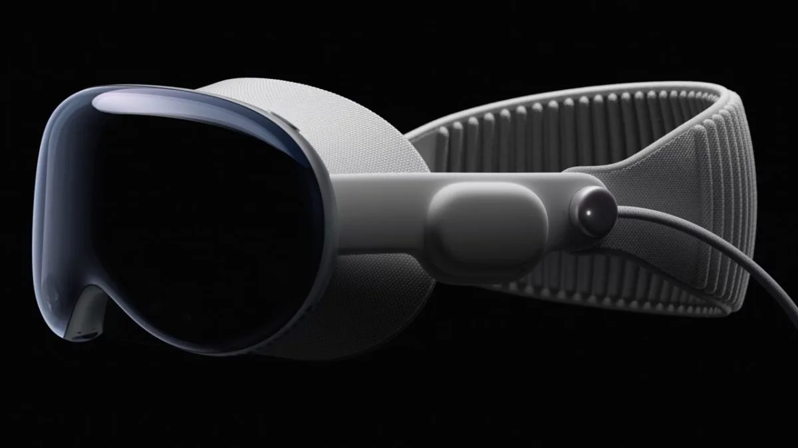
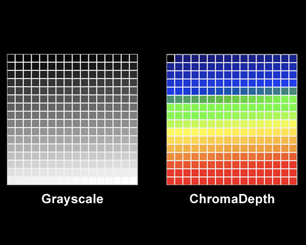
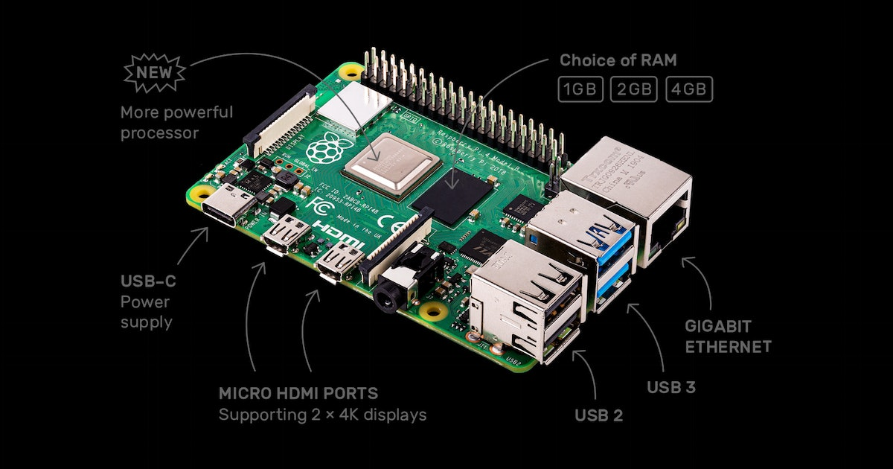
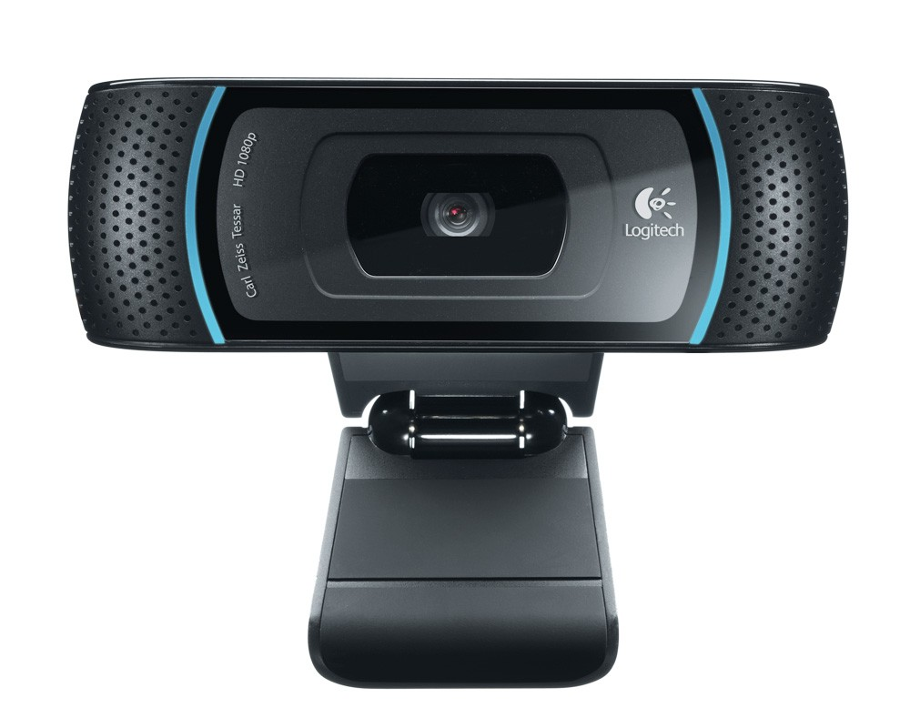

# La Réalité virtuelle et la réalité augmenter

## La réalité virtuelle qu'est-ce que c'est ?

La réalité virtuelle est une technologie qui crée un environnement artificielle sont générés par des logiciels. Cette environnement permet à l'utilisateur d'intéragir avec les éléments afficher. La réalité virtuelle permet de vivre une experience immersive qui peut être simulation réaliste ou une expérience fictive. La réalité virtuelle vise donc à créer un environnement 3D immersif.

### Comment sa fonctionne la réalité virtuelle ?

Les casques de réalité virtuelle sont munies de un ou deux écrans LCD ou Oled placer devant les yeux de l'utilisateur pour réduire les interactions avec le monde réelle. Ces casques fonctionne par stéréoscopie, une technique qui permet au cerveau de percevoir un relief. Il y a des lentilles placées entre les écrans et les yeux de l'utilisateur qui permettent de focaliser l'image renvoyer par le casque pour chaque oeil. L'image est créée en fonction de la position de la tête et des yeux de l'utilisateur. Cette image va bouger avec les mouvements de la tête de l'utilisateur et le logiciel va adapter point de vue en conséquence.

## La réalité augmentée qu'est-ce que c'est ?

La réalité augmenter est la superposition de la réalité et d'éléments comme des sons, des images 2D et 3D, des vidéos et autres qui est calculer par un système informatique en temps réel. Cette technologie permet donc d'intégrer des objets virtuels de façon réaliste dans une séquence d'image. La réalité augmentée est utiliser dans plusieurs domaine telles que les jeux vidéos, le cinéma, la télévision, le tourisme, le pilotage,

## La réalité augmentée sur l'oculus quest 2

La réalité augmentée va bientôt faire ses débuts sur oculus quest 2 et permettre au dévleppeur d'explorer cette facette du multimédia en créant des jeux ou des expériences intéractive. Facebook qui est la compagnie qui produit les casques de réalité virtuelle de la marque oculus va se servir des quatres caméras présente sur le casque. Ces caméras sont assez performante mais limiter au noir et blanc pour l'instant mais grâce à l'usage de l'intelligence artificielle il serait possible de rajouter de la couleur à l'image. Ce n'est pas optimale pour le moment et toujours en développement mais peut-être que dans le future cette technologie sera plus avancer et permettra de plus grande possibilité au niveau des projets intéractifs et dans le monde du jeux vidéo.

# Concepte de projet en réalité augmentée

L'utilsateur va être muni d'un casque de réalité virtuelle. Les caméras intégrées dans le casque seront utiliser pour afficher l'environnement autour de l'utilisateur dans un petit espace. Le casque va utiliser la fonction de suivi des mains pour permettre à l'interacteur d'intéragir avec l'enviromment et les différents objets présent. Pour le problème des couleurs en noir et blanc il sera impossible pour le moment d'utiliser de logiciel ou d'extension permettant l'ajout de couleur. Puisque que le logiciel d'intelligence artificielle qui rajouterait des fausses couleurs à l'image est toujours en développement. Les solutions qui seraient possibles pour régler ce problème serait de soit utiliser un caméra qui serait coller sur le casque qui permettrait de capturer l'image en couleur ou de développer une extension qui convertirait les differentes teintes de gris de l'image vers de la couleur. Le problème avec l'extension qui convertirait les teinte de gris vers de la couleur ne serait utilisable que dans l'environnement pour lequelle il a été configuré puisqu'il pourrait ne pas détecter certaine teinte dans d'autres environnements pour lesquelles il n'a pas été confguré. L'option la plus simple serait donc d'installer une caméra qui permettrait donc d'afficher l'environnement en couleur. Il faudrait donc synchroniser la caméra au casque pour permettre l'affichage des alentours. Il y aurait sûrement du delai entre la caméra et le casque. Pour permettre à la caméra d'être relier au casque nous pourrions connecter la caméra au wifi et la connecter a un raspberry pi ou un ordinateur et utiliser le casque comme un moniteur d'ordinateur pour afficher ce que la caméra voit. 

# Sources

Réalité virtuelle 

- https://fr.wikipedia.org/wiki/R%C3%A9alit%C3%A9_virtuelle
- https://www.campustech.fr/utiliser-casque-realite-virtuelle/
- https://virtual-guru.com/faq/comment-fonctionne-la-realite-virtuelle/
- https://www.realite-virtuelle.com/casque-vr-comment-ca-marche/
- https://www.group-digital.fr/tout-savoir-sur-les-casques-de-realite-virtuelle.html
- https://www.reddit.com/r/OculusQuest/comments/eiy8g2/connecting_quest_to_an_external_camera/

Réalité augmentée

- https://fr.wikipedia.org/wiki/R%C3%A9alit%C3%A9_augment%C3%A9e
- https://visao.ca/fr/technologie-realite-augmentee/#:~:text=La%20r%C3%A9alit%C3%A9%20augment%C3%A9e%20est%20une%20technologie%20et%20un,images%2C%20du%20texte%2C%20des%20sons%20et%20des%20vid%C3%A9os.
